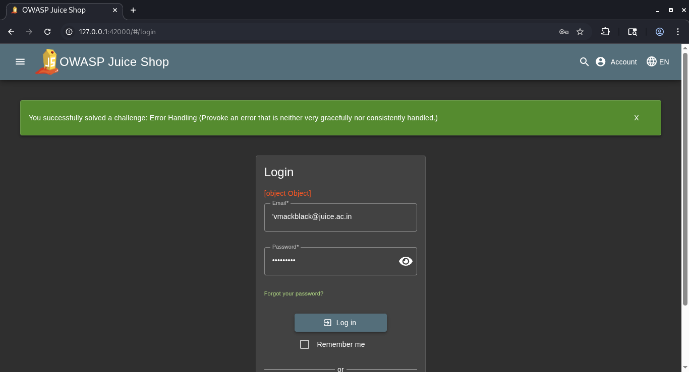

## OWASP Juice Shop Write-up: Error Handling

### 📌 Challenge Overview

### 📊 Details

* **Challenge Title:** Error Handling
* **Category:** Security Misconfiguration
* **Difficulty:** ⭐ (1/6 - Beginner)
* **Objective:** Provoke an error that is neither gracefully nor consistently handled, revealing sensitive system details.

---

### ❓ Why This Matters

When an application encounters an unexpected situation (like an invalid database query or a broken input), it triggers an error. In a secure application, the system catches this error internally and displays a generic, friendly message to the user (e.g., *"Something went wrong. Please try again later."*).

However, if **Error Handling** is misconfigured, the application might spit out raw system logs, database queries, or a complete code execution roadmap—known as a **Stack Trace**—directly to the front-end browser. Attackers love verbose error messages because they act like blueprint leaks, exposing backend database structures, dependencies, programming languages, and specific code flaws that can be targeted for deeper exploitation.

---

### 🛠️ Tools Used

* **Standard Web Browser:** Google Chrome, Mozilla Firefox, or Microsoft Edge.
* **Browser Developer Tools (DevTools):** To inspect server responses via the Network panel.

---

### 🚀 Methodology and Solution

To solve this challenge, we need to send the server an input it doesn't expect or know how to handle properly, forcing it to crash transparently.

#### Step 1: Open the Application Network Monitor

1. Navigate to your local OWASP Juice Shop homepage (e.g., `http://localhost:3000`).
2. Right-click anywhere on the page and select **Inspect**, or press **F12** to open the Developer Tools.
3. Switch over to the **Network** tab. This will allow you to see raw communications traveling between your browser and the backend server.

#### Step 2: Trigger a Server-Side Malfunction

There are multiple input fields in the application that interface with the backend database. A classic way to break a standard SQL/NoSQL query logic block is by inputting a rogue control character like a single quote (`'`).

1. Navigate to the **Login** page (`http://localhost:3000/#/login`).
2. In the **Email** field, type a single quote character: `'`
3. Type any random string into the **Password** field (e.g., `12345`).
4. Click the **Log In** button.

#### Step 3: Inspect the Verbose Error (The Solution)

1. Look down at your **Network** panel in DevTools. You will notice a failed HTTP POST request to `/api/Users/login` highlighted in red with a status code of `500 Internal Server Error`.
2. Click on that specific network request row and select the **Response** or **Preview** tab.
3. Instead of a generic error message, you will see a detailed raw JSON error containing a full backend stack trace:
```json
{
  "error": "SequelizeDatabaseError: SQLITE_ERROR: unrecognized token: \"'\""
}

```


4. Because the server completely failed to handle this unexpected input gracefully and leaked its internal database flavor (`SQLite`), the framework registers the vulnerability, and the challenge success banner will pop up immediately!

---

## Screenshot


### 🧠 Technical Explanation

The application uses an Object-Relational Mapping framework called *Sequelize* to speak to an *SQLite* backend database.

When you inputted the raw `'` character, the application blindly dropped it straight into the database query execution wrapper without filtering it. The database engine tried to parse the extra quote, got confused, threw a database runtime exception, and crashed. Because the developers forgot to wrap this login loop inside a proper `try-catch` block that filters output, the server took the exact raw error string straight from the operating system level and pushed it raw back to your user browser view.

---

### 🛡️ Remediation and Best Practices

Securing an application against info-leaking exceptions requires implementing uniform, sanitized reporting structures:

* 🔒 **Implement Global Catch-All Handlers:** Utilize global exception filters (such as middleware handlers in Express.js) to catch any unhandled rejections cleanly before they exit the server boundary.
* 🛡️ **Sanitize Client-Facing Messages:** Ensure that your production runtime configuration completely strips out stack traces, internal variables, and component properties from API error payloads. Return a structured, generic generic error template and an internal tracking identifier instead (e.g., `{"error": "Internal Server Error", "reference": "ERR-90210"}`).
* 🧹 **Centralize Server Logs Securely:** While the user should never see stack traces, developers still need them to fix bugs. Write detailed debug stack traces internally to secure, server-side log files or APM tracking tools that are strictly accessible only to authorized administration teams.

---
