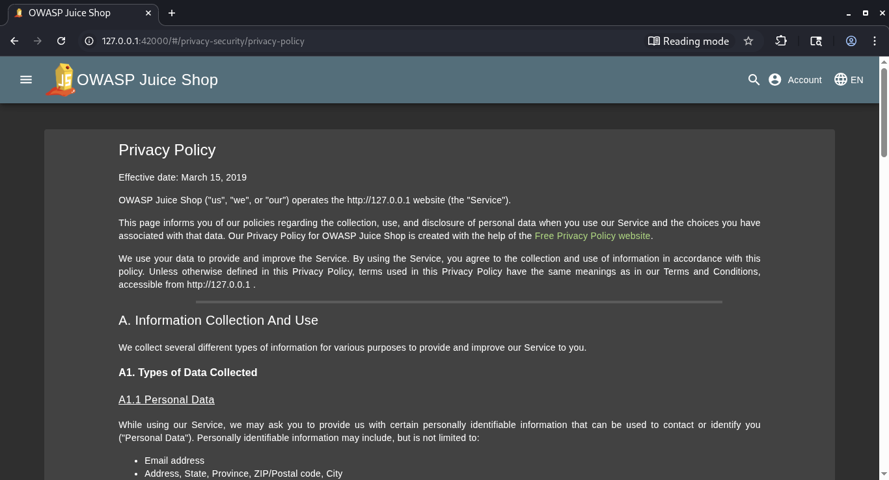

## OWASP Juice Shop Write-up: Privacy Policy

### 📌 Challenge Overview

### 📊 Details

* **Challenge Title:** Privacy Policy
* **Category:** Miscellaneous
* **Difficulty:** ⭐ (1/6 - Beginner)
* **Objective:** Locate and read the application's Privacy Policy page.

---

### ❓ Why This Matters

In modern web applications, compliance documents like Privacy Policies and Terms of Service are required legally, but they are occasionally tucked deep inside complex account navigation configurations.

This challenge serves as a foundational baseline test of basic web application enumeration and interface exploration. It reinforces the habit of thoroughly reviewing all accessible features, public profile tabs, and footer mappings when conducting a comprehensive security assessment or footprinting phase.

---

### 🛠️ Tools Used

* **Standard Web Browser:** Google Chrome, Mozilla Firefox, or Microsoft Edge.

---

### 🚀 Methodology and Solution

To solve this challenge, we simply need to navigate through the client-side user account menu options to find where the policy page link is explicitly bound.

#### Step 1: Access the Account Navigation Menu

1. Open your local OWASP Juice Shop application in your browser (e.g., `http://localhost:3000`).
2. Look at the upper right-hand corner of the navigation bar and click on the **Account** button.

#### Step 2: Expand the Privacy & Security Settings

1. In the drop-down menu that opens, look down and click on the **Privacy & Security** subsection option.
2. A secondary sub-menu drawer will expand, revealing multiple configuration alternatives.

#### Step 3: Trigger the View (The Solution)

1. Click directly on the **Privacy Policy** option within that sub-menu.
2. The browser will instantly load the page component path at:
`http://localhost:3000/#/privacy-security/privacy-policy`
3. As soon as the page text renders on screen, the framework registers your access event, and the success notification banner will drop down from the header confirming that the challenge is complete!

---

## Screenshot

### 🧠 Technical Explanation

Unlike administrative panels or hidden scoreboards that require analyzing minified code bundles, this resource is fully public and integrated intentionally into the client application layer routing maps.

The challenge simply confirms that a tester can map typical single-page application (SPA) path hierarchies. It checks if the user understands how the component-based template structures handle client-side routing extensions (`#/privacy-security/privacy-policy`) to load unique documentation packages statically into the primary viewport layout.

---

### 🛡️ Remediation and Best Practices

While an informational privacy page is harmless and completely safe to expose, managing access paths properly keeps applications orderly:

* 🔒 **Exposed Document Inventorying:** Regularly audit all exposed template routes in your build pipeline to ensure they only lead to intentionally public markdown layouts, avoiding leaking old test pages or debug components.
* 🛡️ **Consistent Navigation Placement:** Ensure that standard policy files are consistently placed in accessible global footers rather than deeply nested user state components, ensuring easier crawling access for automated accessibility compliance scanners.
* 🧹 **Keep Non-Essential Logic Clean:** Verify that dynamic content loaders rendering legal documentation do not accidentally accept unvalidated file path inputs, which can mutate simple document reading endpoints into Local File Inclusion (LFI) bugs.
